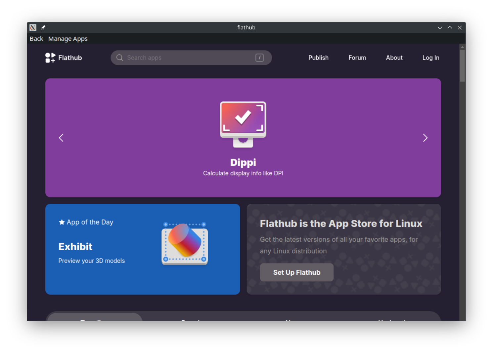
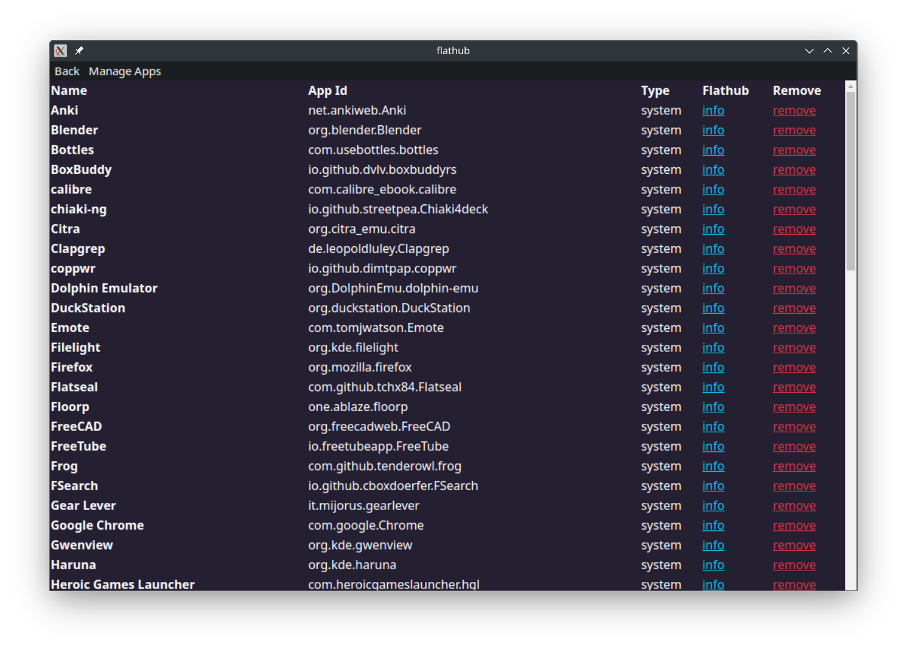

# Flathub electron

A simple electron app wrapper for Flathub

# Features

- flathub webview + install prompts when you click `Install` on the flathub webview
  - the app intercepts the download of `.flatpakref` files, and instead will prompt the user to install the app directly
- manage apps page to allow quick removal of apps
- AppIndicator tray icon for keeping the app open + minimized in the background

## Installation

### Linux

- Download AppImage from releases
- Install the AppImage with your preferred AppImage manager, I'd recommend GearLever

# Build from source

- Clone git repository
- Open the project folder in your IDE
- run `npm install`
- run `npm run build`
- Built app can be located at `./dist/`

# Credits

- Flathub icon is from the flathub press kit
- Bootstrap for css + js
